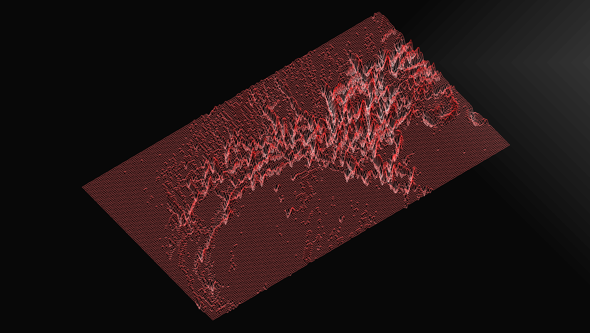
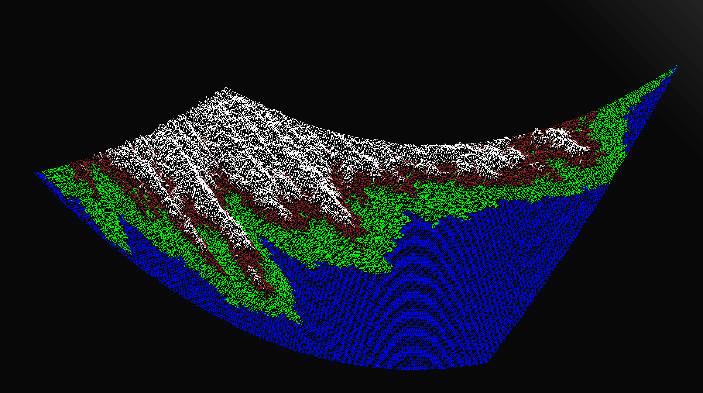
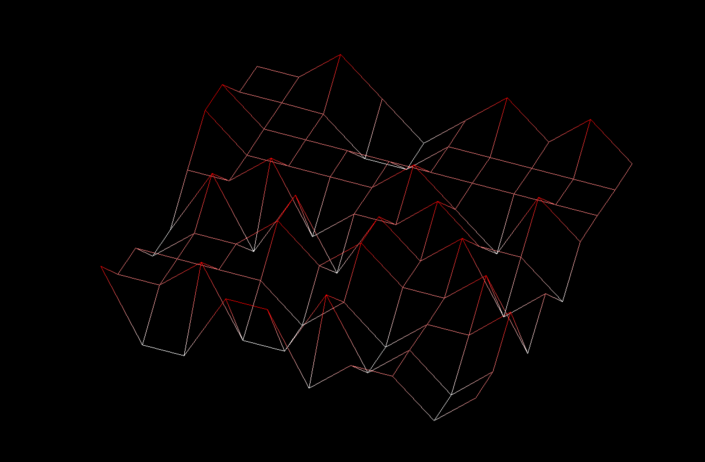

# FDF
Simple wiremesh visualizer with full rotation, panning and colors

# setup
This project is a real bastard, no lie. I would'nt bother building it for yourself as this was made very specifically for the school computers with some questionable hard coded properties\
if you really want to tho, just run make and make sure you have cmake, glfw and gl installed and make sure glfw gets found properly in the makefile if you're on macos

here's some traveling photos from my trip to the wiremeshes:

